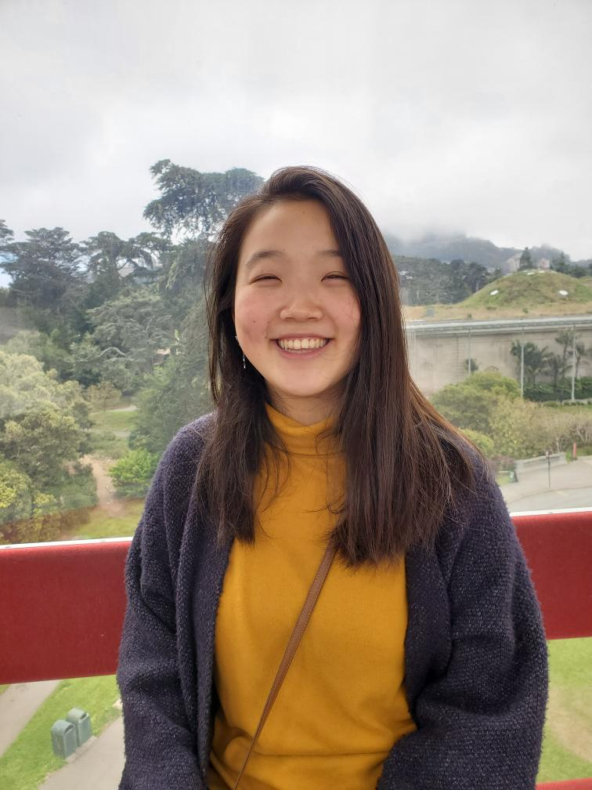

Hi there! I’m a third-year Ph.D. student in Computer Science at UC Berkeley working with professors Niloufar Salehi and Rediet Abebe. 
  My current research applies methods from human-computer interaction (HCI) and machine learning (ML) to evaluate
  the reliability and validity of statistically-driven systems used to produce evidence in the U.S. criminal legal system. 
  I'm interested in exploring how developers, users, impacted communities, and policymakers can each play a role in ensuring responsible and reliable development, deployment, and use of algorithmic decision-making systems.

Prior to joining Berkeley, I graduated from Cornell University with a B.S. in Computer Science, where I had the privilege of working with and learning from Shuang Chen, José F. Martínez, Christina Delimitrou, and many others.

My research is supported by an NSF Graduate Research Fellowship. 

## Publications

### Berkeley
Angela Jin, Niloufar Salehi. "(Beyond) Reasonable Doubt: Challenges that Public Defenders Face in Scrutinizing AI in Court." To appear in ACM Conference on Human Factors in Computing Systems (CHI) 2024. [[paper]](https://arxiv.org/pdf/2403.13004.pdf)

Rediet Abebe, Moritz Hardt, Angela Jin, John Miller, Ludwig Schmidt, Rebecca Wexler. "Adversarial scrutiny of evidentiary statistical software." In Proceedings of the ACM Conference on Fairness, Accountability, and Transparency (FAccT), 2022. [[paper]](https://arxiv.org/abs/2206.09305)

### Cornell
Shuang Chen, Angela Jin, Christina Delimitrou, José F. Martínez. "ReTail: Opting for Learning Simplicity to Enable QoS-Aware Power Management in the Cloud." In Intl. Symp. on High Performance Computer Architecture (HPCA), 2022. [[paper]](https://ieeexplore.ieee.org/document/9773201)

## News
* **Mar. 2024** - Grateful and excited to present my work with Niloufar Salehi on [challenges that public defenders face scrutinizing and contesting AI used in the U.S. criminal legal system](https://arxiv.org/pdf/2403.13004.pdf), at CHI 2024 and the Northeast HCI meeting in May!

* **Oct. 2023** - Incredibly grateful to meet and learn from others interested in community-centered and community-collaborative work at the _Community-Centered AI_ and _Surfacing Structural Barriers to Community-Collaborative Approaches in Human-Computer Interaction_ CSCW workshops!

* **Apr. 2023** - Attending my first in-person CHI conference and first workshop (Design x Policy) in Hamburg, Germany! 

* **Mar. 2023** - Beyond grateful to be selected as a 2023 NSF Graduate Research Fellowship recipient!

* **Oct. 2022** - I am excited and honored to receive a research grant from the Berkeley Institute of Governmental Studies through the [Center for Democracy and Organizing](https://igs.berkeley.edu/research/research-centers-and-programs)!

* **Oct. 2022** - I had an amazing time meeting people and presenting a poster at the Doctoral Consortium of the first in-person [ACM EAAMO conference](https://eaamo.org) in Washington, D.C.!

* **Jun. 2022** - I am honored to announce that I have been selected to join the [Berkeley AI Policy Hub](https://cltc.berkeley.edu/aipolicyhub/) this coming Fall!

* **Jun. 2022** - Very excited to be presenting [Adversarial Scrutiny of Evidentiary Statistical Software](https://arxiv.org/abs/2206.09305) in-person this month, at FAccT 202 in Seoul, South Korea! Looking forward to attending my first in-person conference and to meeting people there!

